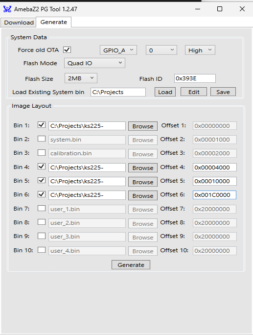

layout: post
title: "Figuring out kasa switches"
date: 2023-10-17 12:00:00 -0000
categories: kasa-tapo

# Why

I have these full flash dumps that won't download back to the device. The process just times out early on.

I can freely flash separate images onto the same device though. So maybe it just doesn't want to write to the reserved parts?

Let's investigate!

# binary format

Stole this from the AmebaZII application note:

| Items | Start Offset Address | Limit Offset Address | Address Adjustable | Size | Description |
|-------|----------|---------|-----------|---------|---------|
|Partition table |0x00000000|0x00001000-1        | N | 4KB | First 32 bytes is flash calibration patter. The actual partition table starts from 0x20|
|System data     |0x00001000|0x00002000-1        | N | 4KB | System settings (not user-configurable) |
|Calibration data|0x00002000|0x00003000-1        | N | 4KB | Calibration data (not user-configurable) |
|Reserved        |0x00003000|0x00004000-1        | N | 4KB | Reserved (not user-configurable) |
|Boot image      |0x00004000|0x0000C000-1        | N | 32KB |
|Firmware 1      |0x0000C000|0x0000C000 + N*4KB-1| N | N*4KB |

First, let's see what's up in the partition table! I'll just open the flash dump in a hex editor...

Referring to the partition table format...

(Note: there used to be a lot of investigation logs here. Hours of bashing my head agains the table, I figured out the values in the binary are little-endian, so I need to read them backwards).

Manually parsing the fields here, we get:

* Dec public key @0x20: 
* Hash public key @0x40: 
* Header @0x60: 
* Image info @0xC0: 
  * NUM: 2
  * FW1 id: 1
  * FW2 id: 2
  * VAR id: FF (none?)
  * MP id: FF (none?)
  * OTA trap: 0000
  * MP trap: 0000
  * Key_Exp_op: 1
* User data len @0xD0: 0x0100
* Boot partition @0xE0:
  * Start address: 0x4000
  * Length: 0x8000 (end at 0xC000 - 1)
  * Type: 01 (boot)
  * DBG_SKIP: 00
* Firmware1 @0x120:
  * Start address: 0x010000
  * Length: 0x1B0000 (ending at 0x1C0000)
  * Type: 05 (fw1)
  * DBG_SKIP: 00
* Firmware2 @0x160:
  * Start address: 0x1C0000
  * Length: 0x1B000 (ending in 0x370000)
  * Type: 06(fw2)
  * DBG_SKIP: 00
* User Data @0x1A0
* Hash @0x2A0

These addresses may not be very conventional, but we can work with that! Just to make sure the rest of the flash is not used in an unconventional way, scroll through the regions outside of the fw images.... 

OK, so here's the thing. My dump is 2MB. The flash chip on the KS225 is 4MB 🤦

Everything I did before was with the 2MB assumption, so hopefully - maybe - the data beyond that is untouched. So I'll just try to write what I have.

After extracting the relevant portions with `dd`, I'm left with these:

Using the "Generate" feature of `AmebaZII_PGTool`, let's try to make a new image:

...and flashing fails with the same error as before:

What I can do though is try to write each split piece one by one, manually specifying offsets. Sidenote - for some reason I need to restart the board in download mode every time (??).

For some reason though, only the Partition image flashes succesfully. Retrying with ltchiptool results in most images flashing properly, but fw1 still fails towards the end (1.3MB/1.7MB).

After a bunch of further investigation, it looks like the chip for some reason has trouble writing tons of repeated FF bytes that are used as padding at the end of the sections. Truncating those end parts (or just setting "Writing length" in ltchiptool appropriately, e.g. to `0x5000` for the boot image) seems to help!

...and yet, after all the successes, the chip still doesn't boot. Looks like I did in fact erase the whole flash at some point, nuking the remainder of fw2.

Installing ltchiptool as a Pyhton package and modifying it to be able to read more than 2MiB confirmed my suspicion: everything past 2MiB was just filled with FF :c

The good news is I have another one of those switches. The bad news is that it's in the wall, and it's currently the middle of the night. Oh well, some other time.

...hours later, I have a full dump of the other unit! And more hours later, I've finally managed to download it onto the one I'm tinkering with! Hooray!!

Hopefully, now comes the fun part 😁
