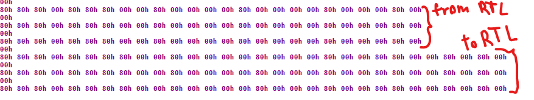

layout: post
title: "So what's up with the scondary chip"
date: 2023-10-18 10:00:00 -0000
categories: kasa-tapo

# What?

Now I can flash stuff onto the chip, and things actually work! I can blink LEDs and stuff!

The only thing that's missing is... well, the actual core functionality of a dimmer switch: switching and dimming the light. That's done by the secondary chip, so let's try to reverse-engineed the protocol to comunicate to it.

I've re-flashed the stock firmware and confirmed that it works (or at least the networking, onboard leds etc all work).

# First attempt

So I've tried to just probe the UART pins with a wire and sniff on the connection! I've chosen the BAUD at random for now, so we're going with 960000.

Aand we have a problem. It looks like the onl communication that happens is sending the same bytes every second, regardless of what I do with the switch and dimmer buttons. yikes.

But I do have a clue I think. The dimmer level LEDs also stay off when the PCB is not connected to the high-voltage part. So maybe there's some kind of status sensing that enables or disables the actual data transfer between the two?

Off to electrocute myself then!

All right, so I definitely burned the FTDI converter and maybe burned the MCU itself and the USB port on my monitor. Fun!

P.S. After some time, the USB hub actually started working again! Hooray!

# Poking around other switches

Now that that one's fried, let's see if we can fry some more. I have Tapo s505d and Kasa KS220 in the walls as well (long story), and they seem to be really similar devices on the first glance. Let's look at the Tapo one!
...aand the logic board is exactly the same! That's noice!

